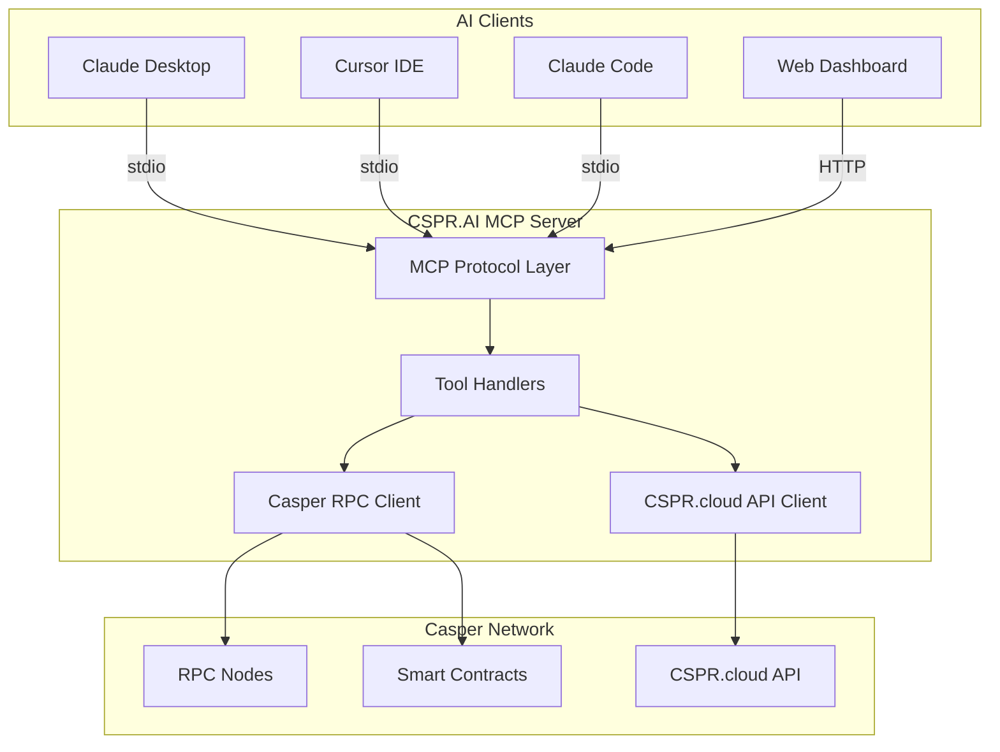

import { Callout } from 'nextra/components'
import { DocCards, DocCard } from '@/components/doc-cards'

# CSPR.AI

**The first AI-powered MCP integration for Casper Network.**

CSPR.AI brings the power of AI to blockchain development, enabling developers and users to interact with the Casper Network using natural language through the Model Context Protocol (MCP).

## Live Deployment

<Callout type="info">
  CSPR.AI is live and ready to use!
</Callout>

| Service | URL |
|---------|-----|
| **Web Dashboard** | [cspr-ai.xyz](https://cspr-ai.xyz) |
| **MCP API** | [mcp.cspr-ai.xyz/mcp](https://mcp.cspr-ai.xyz/mcp) |
| **Health Check** | [mcp.cspr-ai.xyz/health](https://mcp.cspr-ai.xyz/health) |

## What is CSPR.AI?

CSPR.AI is a comprehensive toolkit that connects AI assistants like Claude to the Casper blockchain, allowing you to:

- **Query blockchain data** - Check balances, validators, and transaction history using natural language
- **Build transactions** - Create unsigned transfers, delegations, and smart contract calls
- **Deploy smart contracts** - CEP-18 tokens, NFT collections, DAOs, and DEXs
- **Interact with DeFi** - Manage liquidity pools, execute swaps, and participate in governance

## Key Features

<DocCards cols={2}>
  <DocCard
    title="MCP Server"
    description="50+ AI-powered tools for blockchain interaction via Model Context Protocol"
    href="/mcp-tools"
  />
  <DocCard
    title="Smart Contracts"
    description="Production-ready Odra contracts for tokens, NFTs, DAOs, and DEXs"
    href="/smart-contracts"
  />
  <DocCard
    title="Web Dashboard"
    description="Next.js UI with CSPR.click wallet integration"
    href="/web-dashboard"
  />
  <DocCard
    title="API Reference"
    description="Complete API documentation for HTTP and stdio transports"
    href="/api-reference"
  />
</DocCards>

## Architecture Overview



## Quick Start

Get started with CSPR.AI in minutes:

```bash
# Clone the repository
git clone https://github.com/Blockchain-Oracle/cspr-ai.git
cd cspr-ai

# Install MCP server dependencies
cd mcp-server
pnpm install
pnpm dev

# In another terminal, start the web dashboard
cd ../web
pnpm install
pnpm dev
```

Or use the live deployment directly - see [Configuration](/getting-started/configuration) for details.

## Deployed Smart Contracts (Testnet)

| Contract | Description | Explorer |
|----------|-------------|----------|
| **Token (CEP-18)** | Fungible token with mint/burn | [View on Testnet](https://testnet.cspr.live/contract-package/b481b1e86bc2a1c5d73d5e108c6246ad0358889acc9ef0f429bd4cb454a3bc05) |
| **NFT Collection** | NFT with metadata support | [View on Testnet](https://testnet.cspr.live/contract-package/195b64a1cca143d9361790af34ef79d3094bb00094330c1ccc1cd4987c0b583b) |
| **Governance DAO** | Proposal and voting system | [View on Testnet](https://testnet.cspr.live/contract-package/91083a42df41a577f2d5695ad4c78f799dc1d3016eccef4ce2a6f9a43c68506f) |
| **AMM DEX** | Token swaps and liquidity pools | [View on Testnet](https://testnet.cspr.live/contract-package/7f09f5c808f2a3a684d70cfe49cec2c6b90c11aa1d8053046d91fd26a342bca1) |

## Network Support

| Network | RPC URL | Explorer |
|---------|---------|----------|
| Testnet | `https://node.testnet.cspr.cloud/rpc` | [testnet.cspr.live](https://testnet.cspr.live) |
| Mainnet | `https://node.cspr.cloud/rpc` | [cspr.live](https://cspr.live) |

## Who is this for?

- **Developers** building on Casper Network who want AI-assisted development
- **Users** who want to interact with blockchain using natural language
- **Protocols** looking to integrate AI capabilities into their dApps
- **Researchers** exploring the intersection of AI and blockchain

## Next Steps

<DocCards cols={2}>
  <DocCard
    title="Getting Started"
    description="Set up your development environment"
    href="/getting-started"
  />
  <DocCard
    title="MCP Tools Guide"
    description="Explore the 50+ available AI tools"
    href="/mcp-tools"
  />
</DocCards>
