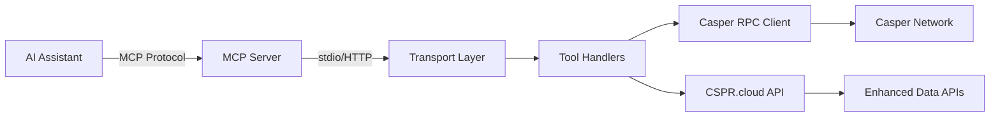

# CSPR.AI MCP Server

Model Context Protocol (MCP) server for Casper Network blockchain integration. Provides 50+ tools for AI assistants to interact with Casper blockchain through natural language.

## Live Deployment

The MCP server is live and ready to use:

| Endpoint | URL |
|----------|-----|
| **MCP API** | https://mcp.cspr-ai.xyz/mcp |
| **Health Check** | https://mcp.cspr-ai.xyz/health |

## Table of Contents

- [Overview](#overview)
- [Features](#features)
- [Installation](#installation)
- [Configuration](#configuration)
- [Transport Modes](#transport-modes)
- [Integration](#integration)
- [Available Tools](#available-tools)
- [Development](#development)
- [Testing](#testing)
- [Docker Deployment](#docker-deployment)
- [API Reference](#api-reference)

## Overview

The CSPR.AI MCP Server implements the Model Context Protocol to bridge AI assistants (Claude, Cursor, etc.) with the Casper Network blockchain. It provides a comprehensive set of tools for:

- Querying blockchain state (balances, validators, transactions)
- Building unsigned transactions (transfers, staking, smart contracts)
- Deploying and interacting with CEP-18 tokens, CEP-78 NFTs, DAOs, and DEX contracts
- Accessing enhanced data via CSPR.cloud API

### Architecture



## Features

### Blockchain Operations

- **Account Management**: Balance queries, account hash conversion, public key validation
- **Validators & Staking**: List validators, query rewards, build delegation transactions
- **Transactions**: Build transfers, query deploy status, track transaction history
- **Network Information**: Auction metrics, era data, time periods

### Smart Contract Support

- **CEP-18 Tokens**: Deploy, query, transfer, mint, burn
- **CEP-78 NFTs**: Deploy collections, mint/transfer/burn NFTs
- **DAO Governance**: Deploy DAOs, create proposals, vote, execute
- **DEX**: Deploy AMM, create pools, add/remove liquidity, swap tokens

### Data APIs

Enhanced data queries via CSPR.cloud:
- Validator performance tracking
- Deploy history with pagination
- NFT metadata and ownership
- Transfer history

## Installation

### Prerequisites

- Node.js 18.x or higher
- pnpm (recommended) or npm

### Install Dependencies

```bash
cd mcp-server
pnpm install
```

### Build

```bash
# Development build with watch mode
pnpm dev

# Production build
pnpm build
pnpm start
```

## Configuration

### Environment Variables

Create a `.env` file in the `mcp-server/` directory:

```bash
cp .env.example .env
```

#### Required Configuration

```bash
# Network Configuration
CASPER_NETWORK=testnet                                    # or "mainnet"
CASPER_RPC_URL=https://node.testnet.cspr.cloud/rpc      # Optional, uses default if not set
```

#### Recommended Configuration

```bash
# CSPR.cloud API (for enhanced data tools)
CSPR_CLOUD_API_KEY=your-api-key-here
```

Get your API key at [cspr.cloud](https://cspr.cloud)

#### Transport Configuration

```bash
# MCP Transport Mode
MCP_TRANSPORT=stdio                                       # "stdio" (default) or "http"

# HTTP Mode Settings (only if MCP_TRANSPORT=http)
MCP_HTTP_PORT=3001                                       # HTTP server port
CORS_ORIGIN=http://localhost:3000                        # CORS allowed origin (comma-separated for multiple)
```

#### Wallet Configuration (stdio mode only)

```bash
# WARNING: Only use in stdio mode (Claude Desktop/CLI)
# NEVER expose private keys in HTTP mode
CASPER_SECRET_KEY=your-private-key-here                  # PEM or hex format
```

**Security Warning**:
- Use `CASPER_SECRET_KEY` only in stdio mode for CLI tools
- Never use in HTTP mode or expose to web frontends
- Web users should sign transactions via CSPR.click wallet

#### Contract Addresses (Optional)

Pre-deployed CSPR.AI contracts on testnet:

```bash
CASPER_TOKEN_CONTRACT_ADDRESS=contract-package-b481b1e86bc2a1c5d73d5e108c6246ad0358889acc9ef0f429bd4cb454a3bc05
CASPER_NFT_CONTRACT_ADDRESS=contract-package-195b64a1cca143d9361790af34ef79d3094bb00094330c1ccc1cd4987c0b583b
CASPER_DAO_CONTRACT_ADDRESS=contract-package-91083a42df41a577f2d5695ad4c78f799dc1d3016eccef4ce2a6f9a43c68506f
CASPER_DEX_CONTRACT_ADDRESS=contract-package-7f09f5c808f2a3a684d70cfe49cec2c6b90c11aa1d8053046d91fd26a342bca1
```

### Network Endpoints

| Network | RPC URL | Explorer |
|---------|---------|----------|
| **Testnet** | https://node.testnet.cspr.cloud/rpc | https://testnet.cspr.live |
| **Mainnet** | https://node.cspr.cloud/rpc | https://cspr.live |

## Transport Modes

The MCP server supports two transport modes for different integration scenarios:

### stdio (Standard Input/Output)

**Default mode** for CLI integration with AI assistants.

**Use cases:**
- Claude Desktop
- Cursor IDE
- Claude Code CLI
- Any MCP-compatible CLI tool

**How it works:**
- Communicates via stdin/stdout
- Follows MCP protocol over standard I/O
- Server runs as a subprocess of the AI assistant

**Start server:**
```bash
pnpm dev
# or
node dist/index.js
```

### HTTP (RESTful API)

**Web-friendly transport** for browser-based integrations.

**Use cases:**
- Web dashboard
- Custom web applications
- REST API integrations
- Mobile applications

**How it works:**
- Exposes HTTP endpoints:
  - `POST /mcp` - MCP protocol endpoint
  - `GET /health` - Health check
- Session management via `mcp-session-id` header
- CORS support for cross-origin requests

**Start server:**
```bash
MCP_TRANSPORT=http pnpm dev
# or
MCP_TRANSPORT=http node dist/index.js
```

**Test endpoints:**
```bash
# Health check
curl http://localhost:3001/health

# List tools
curl -X POST http://localhost:3001/mcp \
  -H "Content-Type: application/json" \
  -H "mcp-session-id: test-session" \
  -d '{"jsonrpc":"2.0","method":"tools/list","id":1}'
```

## Integration

### Claude Desktop

1. **Build the server**
```bash
cd mcp-server
pnpm build
```

2. **Configure Claude Desktop**

Edit `~/Library/Application Support/Claude/claude_desktop_config.json` (macOS):

```json
{
  "mcpServers": {
    "casper": {
      "command": "node",
      "args": ["/absolute/path/to/cspr-ai/mcp-server/dist/index.js"],
      "env": {
        "CASPER_NETWORK": "testnet",
        "CSPR_CLOUD_API_KEY": "your-api-key-here"
      }
    }
  }
}
```

**Important**: Use absolute paths to the built server (`dist/index.js`).

3. **Restart Claude Desktop**

The Casper tools will be available in your next conversation.

### Cursor IDE

1. **Build the server**
```bash
cd mcp-server
pnpm build
```

2. **Add to Cursor settings**

Edit `.cursor/config.json`:

```json
{
  "mcp.servers": {
    "casper": {
      "command": "node",
      "args": ["/absolute/path/to/cspr-ai/mcp-server/dist/index.js"],
      "env": {
        "CASPER_NETWORK": "testnet",
        "CSPR_CLOUD_API_KEY": "your-api-key-here"
      }
    }
  }
}
```

3. **Reload Cursor**

### Claude Code CLI

1. **Build the server**
```bash
cd mcp-server
pnpm build
```

2. **Configure Claude Code**

Edit `~/.claude/config.json`:

```json
{
  "mcpServers": {
    "casper": {
      "command": "node",
      "args": ["/absolute/path/to/cspr-ai/mcp-server/dist/index.js"],
      "env": {
        "CASPER_NETWORK": "testnet",
        "CSPR_CLOUD_API_KEY": "your-api-key-here"
      }
    }
  }
}
```

3. **Use in terminal**
```bash
claude-code
# Casper tools are now available
```

### MCP Inspector

For testing and debugging:

```bash
# Install MCP Inspector
npx @modelcontextprotocol/inspector

# Test stdio mode
npx @modelcontextprotocol/inspector node dist/index.js

# Test HTTP mode
MCP_TRANSPORT=http pnpm dev
# Then navigate to http://localhost:3001 in the inspector
```

## Available Tools

### Account & Balance

- `casper_get_balance` - Query CSPR balance for an account
- `casper_wallet_status` - Check wallet configuration status

### Validators & Staking

- `casper_get_validators` - List active validators with stakes
- `casper_get_current_validators` - Get current era validators (paginated)
- `casper_get_validator_rewards` - Query validator reward history
- `casper_get_validator_blocks` - Get blocks proposed by validator
- `casper_get_staking_info` - Check delegation status for an account
- `casper_build_delegation` - Build stake delegation transaction

### Transactions

- `casper_build_transfer` - Build unsigned CSPR transfer
- `casper_get_deploy` - Get detailed deploy information
- `casper_get_deploy_status` - Quick transaction status check
- `casper_check_deploy_status` - Verify deploy status
- `casper_get_account_deploys` - List all deploys for an account
- `casper_get_account_transfers` - Get native CSPR transfer history
- `casper_sign_and_submit_transaction` - Sign and submit transaction (stdio only, requires CASPER_SECRET_KEY)

### CEP-18 Tokens (Fungible Tokens)

- `casper_deploy_token` - Deploy new CEP-18 token contract
- `casper_query_token` - Query token metadata, balances, supply
- `casper_build_token_transfer` - Build token transfer transaction
- `casper_build_token_mint` - Build mint transaction (requires minter role)
- `casper_build_token_burn` - Build burn transaction

### CEP-78 NFTs (Non-Fungible Tokens)

- `casper_deploy_nft` - Deploy new NFT collection contract
- `casper_query_nft` - Query NFT metadata, ownership, collection info
- `casper_build_nft_mint` - Build NFT mint transaction
- `casper_build_nft_transfer` - Build NFT transfer transaction
- `casper_build_nft_burn` - Build NFT burn transaction

### DAO Governance

- `casper_deploy_dao` - Deploy DAO contract with governance token
- `casper_query_dao` - Query proposals, votes, configuration, voting power
- `casper_build_dao_propose` - Create new governance proposal
- `casper_build_dao_vote` - Vote on active proposal
- `casper_build_dao_execute` - Execute approved proposal

### DEX (Decentralized Exchange)

- `casper_deploy_dex` - Deploy AMM-based DEX contract
- `casper_query_dex` - Query pools, reserves, LP balances, swap quotes
- `casper_build_dex_create_pool` - Create new liquidity pool
- `casper_build_dex_add_liquidity` - Add liquidity to pool
- `casper_build_dex_remove_liquidity` - Remove liquidity from pool
- `casper_build_dex_swap` - Swap tokens using constant product formula

### Network Information

- `casper_get_auction_metrics` - Get current era and auction state
- `casper_get_time_periods` - Query time periods for goal planning

## Development

### Project Structure

```
mcp-server/
├── src/
│   ├── index.ts                    # Server entry point
│   ├── constants.ts                # Network constants
│   ├── services/                   # RPC and API clients
│   │   ├── casper-client.ts       # Casper RPC wrapper
│   │   └── cspr-cloud-client.ts   # CSPR.cloud API wrapper
│   ├── tools/                      # MCP tool implementations
│   │   ├── index.ts               # Tool registry
│   │   ├── balance.ts             # Account & balance tools
│   │   ├── validators.ts          # Validator & staking tools
│   │   ├── transactions.ts        # Transaction tools
│   │   ├── contracts/             # Smart contract tools
│   │   │   ├── token.ts           # CEP-18 token tools
│   │   │   ├── nft.ts             # CEP-78 NFT tools
│   │   │   ├── dao.ts             # DAO governance tools
│   │   │   └── dex.ts             # DEX trading tools
│   │   └── signing.ts             # Transaction signing (stdio only)
│   ├── transport/                  # Transport implementations
│   │   └── http.ts                # HTTP transport
│   ├── resources/                  # MCP resources
│   ├── prompts/                    # MCP prompts
│   └── utils/                      # Utilities
├── test/                           # Test suites
│   ├── unit/                      # Unit tests
│   └── integration/               # Integration tests
├── Dockerfile                      # Docker image
├── package.json                    # Dependencies and scripts
├── tsconfig.json                   # TypeScript config
└── .env.example                    # Environment template
```

### Running Tests

```bash
# Run all tests
pnpm test

# Run with UI
pnpm test:ui

# Run with coverage
pnpm test:coverage

# Run specific test file
pnpm test src/tools/balance.test.ts

# Run integration tests (requires network access)
pnpm test:integration
```

### Code Quality

```bash
# Type check
pnpm type-check

# Format code (if configured)
pnpm format

# Lint (if configured)
pnpm lint
```

## Docker Deployment

### Build Docker Image

```bash
docker build -t cspr-ai-mcp:latest .
```

### Run Container (HTTP Mode)

```bash
docker run -d \
  --name cspr-ai-mcp \
  -p 3001:3001 \
  -e CASPER_NETWORK=testnet \
  -e CSPR_CLOUD_API_KEY=your-api-key \
  -e MCP_TRANSPORT=http \
  -e CORS_ORIGIN=https://your-domain.com \
  cspr-ai-mcp:latest
```

### Health Check

```bash
curl http://localhost:3001/health
```

### View Logs

```bash
docker logs -f cspr-ai-mcp
```

### Stop Container

```bash
docker stop cspr-ai-mcp
docker rm cspr-ai-mcp
```

## API Reference

### Transaction Building

All `build_*` tools return **unsigned transactions** in the following format:

```typescript
{
  "type": "transfer" | "delegate" | "token_transfer" | "nft_mint" | ...,
  "unsigned_deploy": {
    "hash": "...",                  // Transaction hash
    "header": {
      "account": "...",             // Sender account
      "chain_name": "casper-test",  // Network chain name
      "timestamp": "...",           // ISO timestamp
      "ttl": "30m",                 // Time to live
      "gas_price": 1                // Gas price multiplier
    },
    "payment": { ... },             // Payment logic
    "session": { ... },             // Session logic (contract call or transfer)
    "approvals": []                 // Empty (unsigned)
  }
}
```

### Signing Transactions

**stdio mode (CLI)**:
```bash
# Set CASPER_SECRET_KEY in .env
# Use casper_sign_and_submit_transaction tool
```

**HTTP mode (Web)**:
- Client receives unsigned transaction
- User signs with CSPR.click wallet
- Client submits signed transaction to network

### Error Handling

All tools return errors in MCP format:

```json
{
  "error": {
    "code": -32000,
    "message": "Error description",
    "data": { /* additional context */ }
  }
}
```

Common error codes:
- `-32000`: Invalid parameters
- `-32001`: Network error
- `-32002`: Contract error
- `-32003`: Validation error

## Support

- **Issues**: https://github.com/Blockchain-Oracle/cspr-ai/issues
- **Casper Network**: https://casper.network
- **CSPR.cloud**: https://cspr.cloud
- **Model Context Protocol**: https://modelcontextprotocol.io

## License

MIT License - see LICENSE file for details
